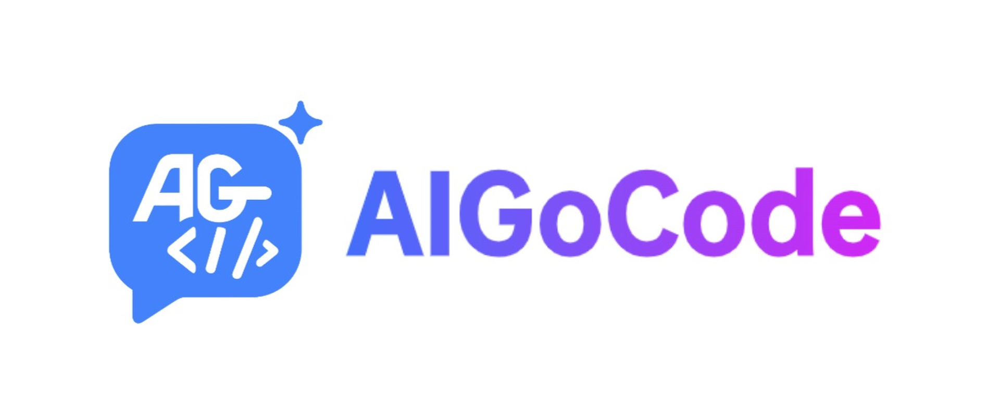
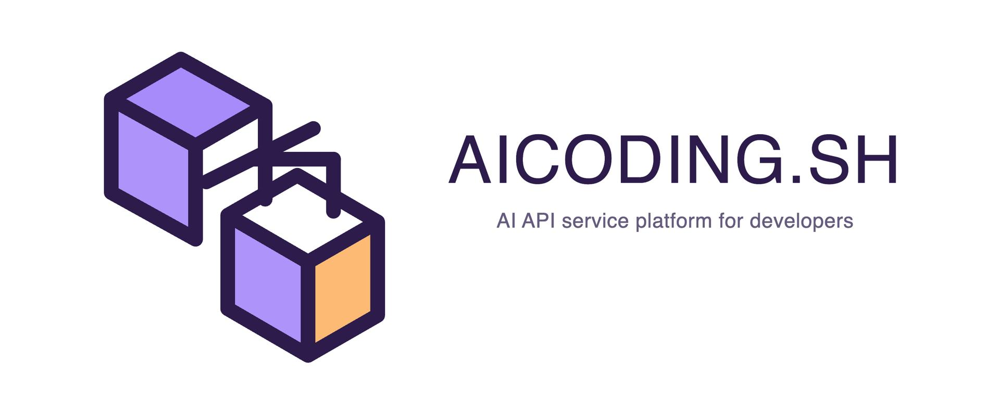

<div align="center">

# CC Switch (Fork)

基于 [farion1231/cc-switch](https://github.com/farion1231/cc-switch)，当前 Fork 已同步至上游 `v3.14.1`。

**个人自用修改版，主打能用就行。** 新增或修改的功能未经充分测试，**可能存在 bug 或与上游不兼容**，介意请使用[官方版](https://github.com/farion1231/cc-switch)。

[](https://github.com/kongkongyo/cc-switch/releases)
[](https://github.com/kongkongyo/cc-switch/releases)
[](https://tauri.app/)
[](https://github.com/kongkongyo/cc-switch/releases/latest)

[中文首页](README.md) | [English](README_EN.md) | [日本語](README_JA.md) | 中文 | [更新日志](CHANGELOG.md)

</div>

## 与上游的区别

| 功能 | 官方版 | 本 Fork |
|------|--------|---------|
| 供应商卡片 | 只显示名称 | 名称后直接显示当前模型名 |
| 模型选择 | 主要靠手填 | 支持搜索下拉、匹配排序、高亮选择 |
| 获取模型列表 | 获取后主要用于填充 | 获取后可直接搜索模型 |
| 新增供应商位置 | 默认排到最后 | 默认插入到第二位 |
| 供应商右键菜单 | 无置顶/置底快捷操作 | 支持右键置顶 / 置底 |
| 托盘左键单击 | 弹出菜单 | 直接切换主窗口显示 / 隐藏 |
| 模型测试 | 入口较弱 | 恢复测试模型按钮，并保留高级测试参数配置 |
| 测试提示词 | 固定单条或可配性弱 | 内置 18 条提示词池，测试时随机抽取 1 条，支持用户自定义多行提示词 |
| 更新方式 | 上游自动更新链路 | 检查本仓库 Releases，提示用户手动更新 |
| 发布来源 | 上游仓库 Releases | 本 Fork 仓库独立发布 |

---

## ❤️赞助商

[](https://platform.minimaxi.com/subscribe/coding-plan?code=7kYF2VoaCn&source=link)

MiniMax M2.7 是 MiniMax 首个深度参与自我迭代的模型，可自主构建复杂 Agent Harness，并基于 Agent Teams、复杂 Skills、Tool Search Tool 等能力完成高复杂度生产力任务；其在软件工程、端到端项目交付及办公场景中表现优异，多项评测接近行业领先水平，同时具备稳定的复杂任务执行、环境交互能力以及良好的情商与身份保持能力。

[点击此处](https://platform.minimaxi.com/subscribe/coding-plan?code=7kYF2VoaCn&source=link)享 MiniMax Token Plan 专属 88 折优惠！

---

<table>
<tr>
<td width="180"><a href="https://www.packyapi.com/register?aff=cc-switch"></a></td>
<td>感谢 PackyCode 赞助了本项目！PackyCode 是一家稳定、高效的 API 中转服务商，提供 Claude Code、Codex、Gemini 等多种中转服务。通过<a href="https://www.packyapi.com/register?aff=cc-switch">此链接</a>注册并在充值时填写 "cc-switch" 优惠码，首次充值可享 9 折优惠。</td>
</tr>

<tr>
<td width="180"><a href="https://aigocode.com/invite/CC-SWITCH"></a></td>
<td>感谢 AIGoCode 赞助了本项目！AIGoCode 集成 Claude Code、Codex 以及 Gemini 最新模型，提供稳定、高效且高性价比的 AI 编程服务。通过<a href="https://aigocode.com/invite/CC-SWITCH">此链接</a>注册，首次充值可获得额外 10% 奖励额度。</td>
</tr>

<tr>
<td width="180"><a href="https://www.aicodemirror.com/register?invitecode=9915W3"></a></td>
<td>感谢 AICodeMirror 赞助了本项目！AICodeMirror 提供 Claude Code / Codex / Gemini CLI 官方高稳定中转服务，支持企业级高并发、极速开票和 7×24 专属技术支持。通过<a href="https://www.aicodemirror.com/register?invitecode=9915W3">此链接</a>注册，可享首充优惠。</td>
</tr>

<tr>
<td width="180"><a href="https://cubence.com/signup?code=CCSWITCH&source=ccs"></a></td>
<td>感谢 Cubence 赞助本项目！Cubence 提供 Claude Code、Codex、Gemini 等模型的中继服务，并支持按量、包月等灵活计费。通过 <a href="https://cubence.com/signup?code=CCSWITCH&source=ccs">此链接</a> 注册并输入 "CCSWITCH" 优惠码，每次充值均可享受九折优惠。</td>
</tr>

<tr>
<td width="180"><a href="https://www.dmxapi.cn/register?aff=bUHu"></a></td>
<td>感谢 DMXAPI 赞助了本项目！DMXAPI 提供全球大模型 API 服务，支持 GPT、Claude、Gemini 及多种国内模型，支持开票与高并发调用。<a href="https://www.dmxapi.cn/register?aff=bUHu">点击这里注册</a>。</td>
</tr>

<tr>
<td width="180"><a href="https://www.right.codes/register?aff=CCSWITCH"></a></td>
<td>感谢 Right Code 赞助了本项目！Right Code 稳定提供 Claude Code、Codex、Gemini 等模型的中转服务，主打高性价比 Codex 套餐和额度转结。通过<a href="https://www.right.codes/register?aff=CCSWITCH">此链接</a>注册，每次充值均可获得额外按量额度。</td>
</tr>

<tr>
<td width="180"><a href="https://aicoding.sh/i/CCSWITCH"></a></td>
<td>感谢 AICoding.sh 赞助了本项目！AICoding.sh 提供 Claude Code、GPT、Gemini 及国内主流模型的高性价比 API 中转服务。通过<a href="https://aicoding.sh/i/CCSWITCH">此链接</a>注册的 CC Switch 用户，首充可享优惠。</td>
</tr>

<tr>
<td width="180"><a href="https://crazyrouter.com/register?aff=OZcm&ref=cc-switch"></a></td>
<td>感谢 Crazyrouter 赞助了本项目！Crazyrouter 是一个高性能 AI API 聚合平台，一个 API Key 即可访问 300+ 模型，包括 Claude Code、Codex、Gemini CLI 等。通过<a href="https://crazyrouter.com/register?aff=OZcm&ref=cc-switch">此链接</a>注册可获得专属福利。</td>
</tr>

<tr>
<td width="180"><a href="https://www.sssaicode.com/register?ref=DCP0SM"></a></td>
<td>感谢 SSSAiCode 赞助了本项目！SSSAiCode 致力于提供稳定、可靠、平价的 Claude / Codex 模型服务，支持包月和 PayGo，并支持当日快速开票。通过<a href="https://www.sssaicode.com/register?ref=DCP0SM">此链接</a>注册可获得额外奖励。</td>
</tr>
</table>

## 界面预览

|                  主界面                   |                  添加供应商                  |
| :---------------------------------------: | :------------------------------------------: |
|  |  |

## 功能特性

### 当前版本：v3.14.1-fork.1 | [完整更新日志](CHANGELOG.md) | [发布说明](docs/release-notes/v3.14.1-zh.md)

**统一管理 5 个 AI CLI 工具**

- **支持的工具**：Claude Code、Codex、Gemini CLI、OpenCode、OpenClaw
- **供应商管理**：一键导入、切换、排序、复制、导入导出
- **通用配置**：部分供应商可同步到多个应用，减少重复配置

**本 Fork 增强点**

- **模型名直显**：供应商卡片名称后直接显示当前模型
- **模型搜索更顺手**：获取模型列表后，可直接在下拉中搜索和选择
- **新增供应商默认排第二**：避免新加的配置总被放到列表最后
- **右键快捷排序**：供应商卡片支持右键置顶 / 置底
- **托盘左键切换窗口**：无需先展开菜单
- **模型测试增强**：恢复测试入口，并保留高级测试参数设置
- **测试提示词池**：内置 18 条默认测试提示词，每次测试随机选 1 条；也支持你自己改成多行提示词池
- **更新提示改为手动**：检查本仓库 Releases，有新版本时提示用户手动下载

**保留的核心能力**

- **MCP 管理**：统一管理多应用 MCP 配置，支持导入导出和双向同步
- **Prompts / Skills / Sessions**：集中管理提示词、技能与会话历史
- **代理与故障转移**：本地代理、热切换、健康检查、格式转换
- **云同步**：支持自定义配置目录与 WebDAV 同步
- **原子写入与备份**：降低配置损坏风险

## 下载安装

### 系统要求

- **Windows**: Windows 10 及以上
- **macOS**: macOS 12 (Monterey) 及以上
- **Linux**: Ubuntu 22.04+ / Debian 11+ / Fedora 34+ 等主流发行版

### 下载说明

本 Fork 当前发布的安装包以本仓库 Releases 为准：

- **Windows**：`CC-Switch-v{版本号}-Windows-Portable.zip`
- **macOS**：`CC-Switch-v{版本号}-macOS.zip`
- **Linux**：`CC-Switch-v{版本号}-Linux-x86_64.deb`

下载地址：

- [Fork Releases](https://github.com/kongkongyo/cc-switch/releases)

### 更新说明

- 应用会检查本仓库的 Releases
- 检测到新版本后，会提示你前往发布页手动下载更新
- 当前 **不使用** Tauri 自动下载安装链路

## 快速开始

### 基本使用

1. **添加供应商**：点击“添加供应商” → 选择预设或创建自定义配置
2. **切换供应商**：
   - 主界面：选择供应商 → 点击“启用”
   - 系统托盘：直接点击供应商名称，或左键托盘图标切换主窗口显示状态
3. **生效方式**：重启终端或对应 CLI 工具以应用更改，部分场景下 Claude Code 支持更平滑切换
4. **恢复官方登录**：添加官方预设后，按对应 CLI 的登录 / OAuth 流程操作

### MCP / Prompts / Skills / Sessions

- **MCP**：统一管理多应用 MCP 服务器，支持模板导入和自定义配置
- **Prompts**：集中管理 `CLAUDE.md`、`AGENTS.md`、`GEMINI.md`
- **Skills**：支持从 GitHub 仓库或 ZIP 安装技能
- **Sessions**：浏览、搜索并恢复不同应用的会话历史

> **注意**：首次启动时，可以手动导入现有 CLI 配置作为默认供应商。

## 配置与数据位置

- **数据库**：`~/.cc-switch/cc-switch.db`
- **本地设置**：`~/.cc-switch/settings.json`
- **备份目录**：`~/.cc-switch/backups/`
- **技能目录**：`~/.cc-switch/skills/`
- **技能备份**：`~/.cc-switch/skill-backups/`

## 架构总览

### 设计原则

```
┌─────────────────────────────────────────────────────────────┐
│                    前端 (React + TS)                         │
│  ┌─────────────┐  ┌──────────────┐  ┌──────────────────┐    │
│  │ Components  │  │    Hooks     │  │  TanStack Query  │    │
│  │   （UI）     │──│ （业务逻辑）   │──│   （缓存/同步）    │    │
│  └─────────────┘  └──────────────┘  └──────────────────┘    │
└────────────────────────┬────────────────────────────────────┘
                         │ Tauri IPC
┌────────────────────────▼────────────────────────────────────┐
│                  后端 (Tauri + Rust)                         │
│  ┌─────────────┐  ┌──────────────┐  ┌──────────────────┐    │
│  │  Commands   │  │   Services   │  │  Models/Config   │    │
│  │ （API 层）   │──│  （业务层）    │──│    （数据）       │    │
│  └─────────────┘  └──────────────┘  └──────────────────┘    │
└─────────────────────────────────────────────────────────────┘
```

**核心设计模式**

- **SSOT**：所有核心数据统一存储在 `~/.cc-switch/cc-switch.db`
- **双层存储**：SQLite 存储可同步数据，JSON 存储设备级设置
- **双向同步**：切换时写入 live 文件，编辑当前供应商时从 live 配置回填
- **原子写入**：使用临时文件 + 重命名降低配置损坏风险
- **分层架构**：Commands → Services → DAO → Database

## 开发

### 环境要求

- Node.js 18+
- pnpm 8+
- Rust 1.85+
- Tauri CLI 2.8+

### 常用命令

```bash
pnpm install
pnpm dev
pnpm typecheck
pnpm format
pnpm format:check
pnpm test:unit
pnpm build
pnpm tauri build --debug
```

### Rust 后端

```bash
cd src-tauri
cargo fmt
cargo clippy
cargo test
cargo test --features test-hooks
```

## 技术栈

- **前端**：React 18、TypeScript、Vite、TailwindCSS、TanStack Query
- **后端**：Tauri 2、Rust、serde、tokio、thiserror
- **测试**：vitest、MSW、@testing-library/react

## 项目结构

```text
├── src/                      # 前端 (React + TypeScript)
│   ├── components/           # 主要 UI 组件
│   ├── hooks/                # 业务 hooks
│   ├── lib/                  # API 与查询封装
│   ├── locales/              # 多语言资源
│   ├── config/               # 预设配置
│   └── types/                # 类型定义
├── src-tauri/                # 后端 (Rust)
│   └── src/
│       ├── commands/         # Tauri 命令层
│       ├── services/         # 业务逻辑层
│       ├── database/         # SQLite DAO
│       ├── proxy/            # 代理模块
│       ├── session_manager/  # 会话管理
│       ├── deeplink/         # Deep Link
│       └── mcp/              # MCP 同步
├── tests/                    # 前端测试
└── assets/                   # 截图与合作资源
```

## 贡献

欢迎提交 Issue 反馈问题和建议。

提交 PR 前请确保：

- 通过类型检查：`pnpm typecheck`
- 通过格式检查：`pnpm format:check`
- 通过单元测试：`pnpm test:unit`

## Star History

[](https://www.star-history.com/#farion1231/cc-switch&Date)

## License

MIT © Jason Young
